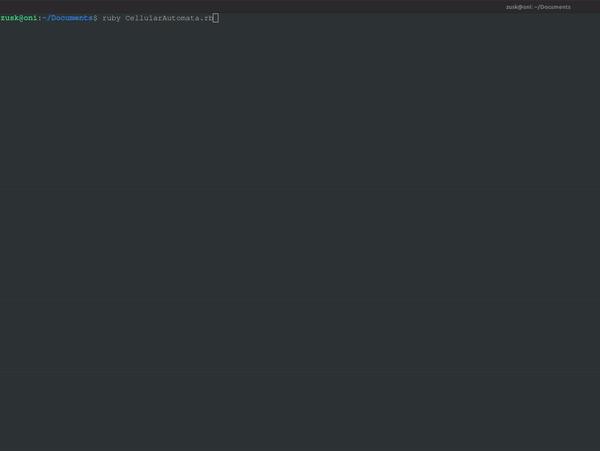

# fast-ruby-nation-cellular-automata
A fast solution to cellular automata written in Ruby.

I wrote this approach as a fast solution for 'Nations' using cellular automata. A nation is just a group of cells that expand and compete with rival cells not of their color. Its meant to be run in the terminal, and requires a few libraries in order to run effectively. Might not work if your terminal doesn't support color.
